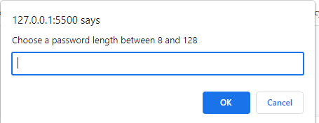
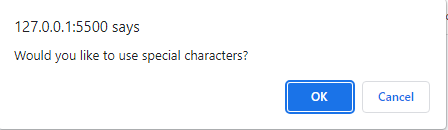

# Password Generator

## Usage

This project is a simple password generator that a will prompt a user for a character length followed by a series of prompts that will ask the user for the specific types of the characters that they want to be included in their password. The options include upper and lowercase letters, numbers and special characters. 

With all of these options available, the user can create any number of random passwords to ensure whatever level of security they deem necessary for their personal information!

*This is the first propmt the user will see upon clicking the "Generate Password" button. If the user selects a password length outside of the establish parameters, they will recieve and alert that will inform them of the required minimum and maximum lengths. The app will restart once the user confirms the alert.*

*This is one of the prompts that a user will see that will handle what characters the user wants included in their password. They must select at least one type or else they will get an alert, and the app will restart upon confirmation of said alert*

## Built With

* [HTML](https://developer.mozilla.org/en-US/docs/Web/HTML)
* [CSS](https://developer.mozilla.org/en-US/docs/Web/CSS)
* [Javascript](https://developer.mozilla.org/en-US/docs/Web/JavaScript)

## Deployed Link

https://chapjae.github.io/password/